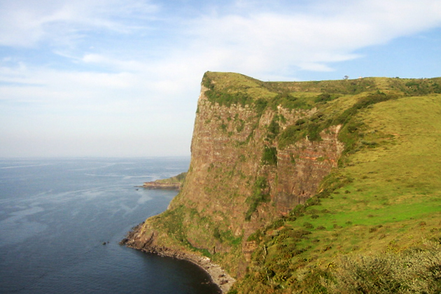

# Udacity's Deep Learning Nanodegree
## Reinforcement Learning: Temporal-Difference Methods
## Mini Project: OpenAI Gym: CliffWalkingEnv

## Project Overview

 Using OpenAI Gym's CliffWalking environment, I implemented temporal-difference(TD) methods to teach an agent to walk through the grid without falling off the cliff. In the CliffWalking environment, the agent navigates a 4x12 gridworld.                        .



```
   This is a simple implementation of the Gridworld Cliff reinforcement learning task.
   Adapted from Example 6.6 from Reinforcement Learning: An Introduction by Sutton and Barto:
   http://people.inf.elte.hu/lorincz/Files/RL_2006/SuttonBook.pdf

   With inspiration from:
   https://github.com/dennybritz/reinforcement-learning/blob/master/lib/envs/cliff_walking.py
   The board is a 4x12 matrix, with (using Numpy matrix indexing):
       [3, 0] as the start at bottom-left
       [3, 11] as the goal at bottom-right
       [3, 1..10] as the cliff at bottom-center
   Each time step incurs -1 reward, and stepping into the cliff incurs -100 reward
   and a reset to the start. An episode terminates when the agent reaches the goal.

```
### Project Instructions

  1. Clone the repository and navigate to the downloaded folder.
    ```
    git clone https://github.com/adityasaxena26/OpenAI-Gym-CliffWalkingEnv.git
    cd OpenAI-Gym-CliffWalkingEnv
    ```
  2. Open Jupyter notebook:
    ``` jupyter notebook```

    Open 'cliffwalking_temporal_difference.ipynb'
